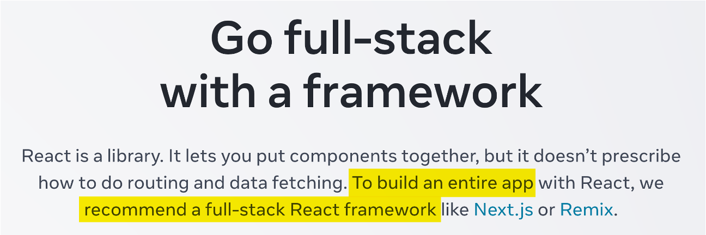
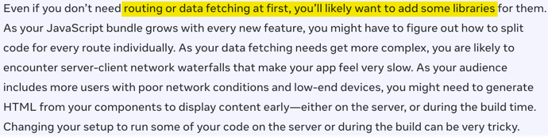
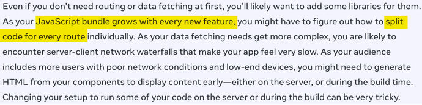
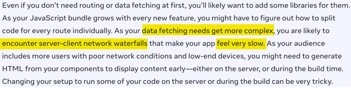
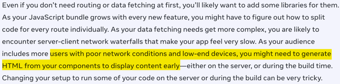
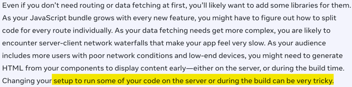
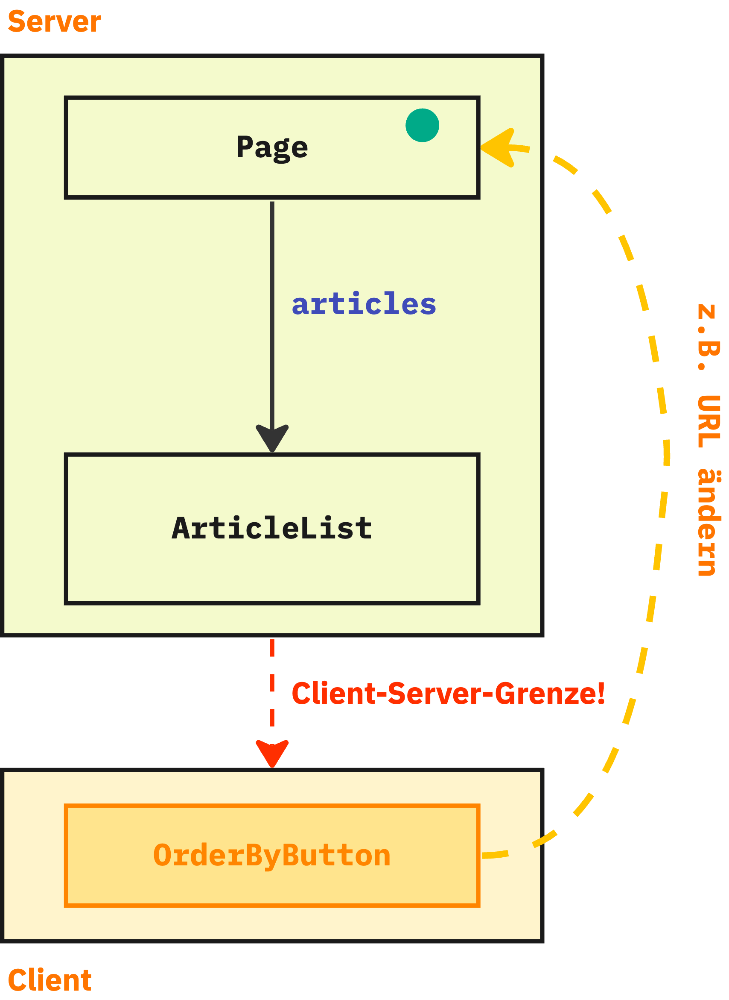

# Next.js

* Serverseitiges framework

---

---

## März 2023...



---

## Demo-Anwendung

---

## Was macht unsere Beispiel-Anwedung aus?

* Viel statischer Content
* Viel JavaScript
* ...gleichzeitig wenig Interaktion

---
## Anforderung

* Die Seiten sollen möglichst schnell für den Benutzer **sichtbar** und **bedienbar** sein

---
## Mögliche Probleme
* Viel JavaScript-Code, der...
  * ...vom Browser geladen werden muss
  * ...interpretiert und ausgeführt werden muss
  * ...mit jeder Komponente mehr wird

---
## Serverseitiges Rendern (SSR)
### Der Klassiker

1. Bei SSR wird die Anwendung auf dem Server ausgeführt

2. Der Server schickt **fertiges HTML** zum Client
   * Gut: Client braucht HTML nur anzuzeigen (schnell!)
   * Gut: Kein JavaScript für die Darstellung notwendig

3. Ebenfalls wird der **komplette Anwendungscode** zum Client geschickt
   * 😢 Auch für statische Komponenten
   * 😢 Bandbreite! Performance!

* 👉 SSR löst Probleme... aber nicht alle

---
## Probleme von Single-Page-Anwendungen
### ...laut React-Team:




Routing und Data Fetching benötigen Bibliotheken<!-- .element: class="mt-5" -->

---
## Probleme von Single-Page-Anwendungen
### ...laut React-Team:



JavaScript-Code (im Browser) wächst mit jedem Feature<!-- .element: class="mt-5" -->

---
## Probleme von Single-Page-Anwendungen
### ...laut React-Team:



Laden von Daten kann Eindruck langsamer App erzeugen<!-- .element: class="mt-5" -->

---
## Probleme von Single-Page-Anwendungen
### ...laut React-Team:



Frühe Darstellung auch bei schlechtem Netzwerk/Hardware<!-- .element: class="mt-5" -->

---
## Probleme von Single-Page-Anwendungen
### ...laut React-Team:



Ausführung von React-Code auf Server/im Build ist kompliziert<!-- .element: class="mt-5" -->


---
## Probleme von Single-Page-Anwendungen
### Wie seht ihr das? 🤔
  * Teilt ihr die Einschätzung des React-Teams?
  * Habt ihr andere Probleme, die in der Aufzählung fehlen?

---
## "Fullstack Architektur-Vision"

* [https://react.dev/learn/start-a-new-react-project#which-features-make-up-the-react-teams-full-stack-architecture-vision](https://react.dev/learn/start-a-new-react-project#which-features-make-up-the-react-teams-full-stack-architecture-vision)

---
## "Fullstack Architektur-Vision"
### <!-- .element: class="fragment" data-fragment-index="0" -->React Server Components (RSC)
* <!-- .element: class="fragment" data-fragment-index="1" -->Komponenten, die auf dem Server, Client und im Build gerendert werden können
* <!-- .element: class="fragment" data-fragment-index="2" -->Data Fetching "integriert"

### <!-- .element: class="fragment" data-fragment-index="3" --> Suspense 
* Platzhalter für "langsame" Teile einer Seite
* Mit Streaming können diese Teile einer Seite "nachgeliefert" werden, sobald sie gerendert sind

---

## React empfiehlt "Fullstack-Framework"
* Server Components erfordern Rendern auf dem Server oder im Build
* Dazu braucht man ein "**Fullstack-Framework**"
* "Framework" ist verharmlosend, weil es sich in der Regel um einen kompletten Stack samt Build-Tools und Laufzeitumgebung handelt
* Deswegen werden solche Frameworks auch als "**Meta-Frameworks**" bezeichnet (=> Sammlung von Frameworks)

---
### React empfiehlt "Fullstack-Framework"
* [Next.js](https://nextjs.org/) entspricht den Vorstellungen des React-Teams
* [Remix](https://remix.run/) (vom React Router Team) unterstützt noch keine RSC, hat aber ähnliche Features
  * Unterstützung für RSC in Planung

---
## Zero-Bundle-Size
# React Server Components

---
### React Server Components
* **Idee:** Komponenten werden **nicht** im **Client** ausgeführt
  * Sie stehen auf dem Client nur **fertig gerendert** zur Verfügung
  * Der Server schickt lediglich *eine Repräsentation der UI*, aber *keinen JavaScript-Code*
  * Das Format ist (im Gegensatz zu SSR) **nicht HTML**
  * Kann aber mit SSR kombiniert werden
  * React bzw. JavaScript muss also im Client laufen

---
### Arten von Komponenten

* **Client-Komponenten** (wie bisher)
  * Werden auf dem **Client** gerendert
  * oder auf dem **Server** 🙄

  * Wie bisher:
    * JavaScript-Code wird vollständig zum Client gesendet
    * Der JavaScript-Code wird auf dem Client ausgeführt
    * Die Komponenten können interaktiv sein
      * Event-Listener etc.

---
### Arten von Komponenten

* **Neu: Server-Komponenten**
  * werden auf dem **Server** gerendert
  * oder im **Build** 🙄

  * liefern UI (!) zum React-Client zurück (kein JavaScript-Code)
  * Werden im Client nicht "ausgeführt"
  * ...und können folglich nicht interaktiv sein (nur ohne JS)

---
### Arten von Komponenten
* Die Komponenten gemischt werden:
  * Server-Komponenten können Client-Komponenten einbinden
    * (umgekehrt geht es nicht)
  * Dann wird alles bis zur ersten Client-Komponente gerendert an den Client gesendet
    * (Mit SSR auch die Client-Komponenten)
---

# RSC am Beispiel Next.js

---
### Der Next.js Router
* App-Router: aktueller Router (seit Version 13.4), der RSC unterstützt
  * (Pages-Router: ohne RSC)
* File-system-basierter Router, es spielt sich alles unterhalb von `app` ab
* In Next.js ist ein Ordner unterhalb von `app` eine Route, wenn darin eine `page.tsx`-Datei liegt
  * `page.tsx` vergleichbar mit `index.html` in klassischem Web-Server 
  * Pfade, die keine `page.tsx`-Datei haben, tauchen zwei in der URL auf, können aber nicht aufgerufen werden
* Diese Datei exportiert per `default export` eine React-Komponente, die für die Route dargestellt werden soll
* ```typescript
  // /app/page.tsx
  export default function LoadingPage() { return <h1>Hello World!</h1> }
  
  // /app/posts/page.tsx
  export default function PostListPage() { return <h1>Blog Posts</h1> }
  ```
---
### Der Next.js Router
* In einem Route-Verzeichnis kann es weitere Dateien geben, die einen festgelegten Namen haben und jeweils per `default export` eine React-Komponente zurückliefern:
* `layout.tsx`: Definiert die Layout-Komponente. 
  * Damit kann über mehrere Routen ein einheitliches Layout festgelegt werden, denn wenn eine Seite gerendert wird, werden alle Layout-Komponenten aus den Pfaden darüber verwendet. So kann eine Hierarchie von Layouts gebaut werden.
* `error.tsx`: Eine Komponente, die als Error Boundary fungiert und gerendert wird, wenn beim Rendern der `page` ein Fehler aufgetreten ist
* `loading.tsx`: Loading-Spinner o.ä., der dargestellt wird, bis die Seite gerendert werden kann (dzau später mehr)
* `not-found.tsx`: Kann verwendet werden, um einen Fehler darzustellen, wenn eine Seite `notFound` zurückliefert
---
### Der Next.js Router: Layouts
* Jede Route kann eine Layout-Komponente haben
* Dieser Komponente wird die darzustellende Seite als `children`-Property übergeben
* Layout-Komponenten können verschachtelt sein
* Wenn eine Route keine Layout-Komponente hat, wird im Baum oberhalb nach der nächstgelegenen Layout-Komponente gesucht
* Die Layout-Komponente für die Root-Route ist *pflicht*. Hier muss eine ganze HTML-Seite beschrieben werden
* ```typescript
  // /app/layout.tsx
  export default function Layout({children}) {
    return <html>
       <head>...</head>
       <body>
         <header><Navigation /></header>
         <main>{children}</main>
       </body>
      <html>
  }
  ```
---
### Navigieren
* Zum Rendern von Links bringt Next.js eine eigene `Link`-Komponente mit
  * Mit einem entsprechenden Plug-in für TypeScript soll die sogar typsicher sein, so dass man keine Routen-Angaben hinschreiben kann, die es gar nicht gibt
    * (hat bei mir beim letzten Versuch nur eingeschränkt funktioniert)
* Verwendung ähnlich wie auch vom React Router (und `a`-Element) gewohnt:
  * `<Link href="/">Home</Link>`
  * 
---
### Eine React Server Komponente
  * **Alle** Komponenten in Next.js sind per Default **Server Components**
    * Ausnahmen (Client Komponenten) müssen explizit gekennzeichnet werden (dazu später mehr)
  * Landing-Page `/page.tsx`
  * `/layout.tsx`
    * `console.log` in `page`-Komponente
---
### Übung: Vorbereitung

* Zum Ausführen der Übungen bitte die benötigten Packages installieren
* Das funktioneirt mit `pnpm` sollte aber auch mit einem anderen Package Manager verwenden
* Wenn Du kein `pnpm` hast, kannst Du den aktivieren, in dem Du `corepack enable` ausführst
* Dann im Verzeichnis `blog-nextjs-workspace` ausführen:
  * `pnpm install`
  * `pnpm dev:clean`
* Die leere Anwendung läuft dann auf Port 3000 (da gibt's aber erstmal noch nichts zu sehen...)

---
### Übung: Getting started!
* Baue eine LandingPage (`/`-Route)
* Die muss nicht hübsch sein (wenn Du willst kannst Du CSS-Modules und/oder Tailwind für Styling verwenden)
* Die Komponente soll einen Link auf `/blog` rendern 
  * Verwende dazu die `Link`-Komponente des Next.js Routers
* Füge außerdem ein `console.log`-Statement in deine Komponente hinzu, das beim Rendern die aktuelle Uhrzeit ausgibt
* Lege außerdem eine Komponente für `/blog` an
  * Es reicht, wenn diese Komponente erstmal nur "Hello World" ausgibt. 
* Wenn die Seite fertig ist:
  * Baue die "Anwendung" (`pnpm build`)
  * Starte die _fertige_ Anwendung, die auf Port 3080 läuft (`pnpm start`)
  * Wann und wo wird dein `console.log` ausgegeben?

---
## Data Fetching

---
## Data Fetching
* Komponente, die Daten benötigen, können diese direkt *in der Komponente* laden
* *Kann* Latenz sparen und bessere Performance bringen
  * "No Client-Server Waterfalls"

* Server Components können die Server-Infrastruktur nutzen (DB, Filesystem)

* 👉 Server-Komponenten können dazu *asynchron* sein

---
## DataFetching
### Demo: Eine asynchrone Server-Komponente

* Das ist ein React-Feature!
  * Next.js-spezifisch nur die `page`-Konvention

* <!-- .element: class="demo" -->PostListPage anlegen

* <!-- .element: class="demo" -->DB-Zugriff mit `getBlogTeaserList`
* <!-- .element: class="demo" -->statische Komponente bislang! Build! console.log!

---
## Suspense

* Suspense unterbricht das Rendern, wenn in einer Komponente "etwas" fehlt
* "Etwas" ist im Fall von RSC ein Promise, das nicht aufgelöst ist
* Dazu kann um eine Komponente die `Suspense`-Komponente von React gelegt werden
* ```typescript
  async function loadData(...) {}
  
  async function PostList() {
    const posts = await loadData();
  
    return <>...</>;
  }
  
  function PostListPage() {
    return <Suspense> fallback={"Please wait"}>
      <PostList />
    </Suspense>
  }
  ```
* Hier würde React zunächst die `fallback`-Komponente (`Please wait`) rendern und darstellen
* Wenn das Promise aufgelöst wird, rendert React dann die Komponente erneut für die finale Darstellung
* Das geht auf dem Server und dem Client
  * Client für Lazy-Loading und Data-Fetching (letzteres noch unstabil)
---
### Suspense in Next.js
* Um die oberste Komponente einer Route (`page.tsx`) legt Next.js eine automatisch eine `Suspense`-Komponente
* Den `fallback` dafür implementieren wir in der Datei `loading.tsx`, die eine Komponente per `default export` exportieren muss
* Konzeptionell sieht das so aus:
  * Eure Route:
  * ```typescript
    // loading.tsx
    export default function Spinner() { return "Please Wait" };
  
    // page.tsx
    export default async function PostListPage() { 
      const data = await loadData();
      return <>...</>
    }
    ```
  * Next.js (dummy code)    
  * ```typescript
    // Next.js (dummy code):
    import Fallback from "loading.tsx"
    import Page from "page.tsx";
  
    function Route() {
      return <Suspense fallback={Fallback}>
        <Page />
      </Supsense>;
    }
    ```

* (Suspense auf dem Client gucken wir uns später unabhängig von Next.js an)

---
## Übung: DataFetching

* Vervollständige die `/blog`-Route
  * Darin mit `getBlogTeaserList` die Daten laden und anzeigen
    * Zur Darstellung der geladenen Posts kannst Du die Komponente `PostTeaser` verwenden oder was eigenens bauen
  * Was passiert, wenn die Daten nur sehr langsam geladen werden?
    * Verlangesame dazu den Zugriff auf die Datenbank künstlich, in dem Du in `backend-queries.ts` mit der Konstante `getBlogTeaserListSlowdown` eine künstliche Verzögerung festlegst (in Millisekunden, z.B. 1600)
  * Füge eine Loading-Komponente (`loading.tsx` hinzu), die eine Warte-Meldung ausgibt

---
### Mehr zu Next.js Routen
* Neben den "klassischen" Verzeichnisnamen, die URL-Segementen entsprechen, gibt es noch weitere Konventionen:
* Ein Pfad in Klammern (`(path)`) taucht in der URL nicht auf. Kann z.B. für eine gemeinsame Layout-Datei oder zur besseren Organisation verwendet werden, wenn man das nicht über die Hierarchie machen kann.
* ```typescript
  // /admin/user
  // /admin/articles
  // /admin/tags
  ```
* Wenn `articles` und `tags` sich ein Layout teilen soll (aber `/user` nicht), kann die Verzeichnisstruktur dafür so aussehen:
* ```typescript
  // /admin/user/page.tsx
  // /admin/(blog)/layout.tsx
  // /admin/(blog)/articles/page.tsx
  // /admin/(blog)/tags/page.tsx
  ```
---
### Mehr zu Next.js Routen  
* Ein Pfad in eckigen Klammern (`/blog/[postId]`) definiert einen Platzhalter. Der Wert für das Segment in der URL wird der Komponente dann zur Laufzeit als Property übergeben:
  * `/blog/P1`, `/blog/xyz` etc.
* ```typescript
  // /app/blog/[postId]/page.tsx
  
  type BlogPostPageProps = {
    params: { postId: string };
  };

  export default function PostPage({params}: BlogPostPageProps) {
    // params.postId enthält den Wert aus der URL (P1, xyz, ...)
    const postId = params.postId;
  }
  ```
---
### Mehr zu Next.js Routen
* Mit der `notFound`-Funktion kann die `not-found`-Komponente aufgerufen werden
* Das ist zum Beispiel nützlich, wenn Daten geladen wurden, die es nicht gibt
* `notFound` bricht die Ausführung der Komponenten-Funktion ab, man braucht kein `return` hinzuschreiben 
* ```typescript
  // /app/blog/[postId]/page.tsx
    export default async function PostPage({params}: BlogPostPageProps) {
    const postId = params.postId;
  
    const blogPost = await getBlogPost(postId);
    if (!blogPost) {
      notFound();  // kein return notwendig
    }
  
    return <Post post={blogPost} />;
  }
  ```
---
### Dynamische und statische Routen
* Durch die Verwendung eines Platzhalters wird eine Route zu einer dynamischen Route, d.h. sie wird **nicht** im Build gerendert, sondern **nur** zur Laufzeit
  * Next.js kann hier nicht im Vorwege wissen, welche Werte für das variable Segment verwendet werden
  * Mit `getStaticPaths` kann das geändert werden
* Auch die Verwendung einiger Next.js APIs führt dazu, dass eine Route nicht mehr statisch, sondern dynamisch ist
  * Das betrifft Funktionen, die mit Daten aus einem Request arbeiten (`headers()` und `cookies()`) 
* Ggf. wird das Ergebnis auf dem Server gecached


---
### Streaming

* Wenn eine Komponente auf dem Server gerendert wird, kann React das Rendern bei einer `Suspense`-Komponente unterbrechen
* Dann wird der Rest der Seite schon zum Client gesendet
* Sobald die Komponenten unterhalb von `Suspense` gerendert werden konnten, werden diese zum Client nachgesendet
* Dieses Verhalten wird auch **Streaming** genannt.
---
### Wasserfall-Requests

* Die `BlogPostPage`-Komponente benötigt Daten aus zwei Quellen: Den Blog-Post und die Kommentare
* Die Antwortzeit der beiden Requests dafür kann bei jedem Aufruf unterschiedlich lang sein
* In einer klassischen React-Architektur könnte es zu einem "Request-Wasserfall" kommen:
  * BlogPost lädt den Artikel (z.B.  `useFetch`) und rendert sich dann damit
  * Beim rendern bindet sie die `Comments`-Komponente ein. Diese lädt nun (ebenfalls) per `fetch` ihre Daten und stellt sich dar.
  * Die beiden Requests starten also nicht zeitgleich, und die Dauer, bis die Daten vollständig angezeigt werden können, setzt sich aus der Dauer der **beiden** Requests zusammen
* Kennt ihr das Problem? Meint ihr das ist ein Problem? Was könnte man dagegen tun 🤔

---
### Wasserfälle vermeiden
* Mit `Suspense` können wir grundsätzlich priorisieren, was uns wichtig(er) ist:
  1. Die Seite wird erst dargestellt, wenn alle Daten geladen sind
  2. Sobald "irgendwelche" Daten (Artikel oder Kommentare) geladen wurden, diese Daten sofort anzeigen.
  3. Erst wenn die Artikel geladen wurden, diese darstellen (Falls Kommentare "schneller" sind, die Kommentare nicht vorab anzeigen)
* <!-- .element: class="demo" --> Die drei Beispiel durchgehen (für 2. die `Post`-Komponente vorübergehend umbauen)

---
### Wasserfälle vermeiden
* Mit `Suspense` können wir grundsätzlich priorisieren, was uns wichtig(er) ist:
  1. Die Seite wird erst dargestellt, wenn alle Daten geladen sind
  2. Sobald "irgendwelche" Daten (Artikel oder Kommentare) geladen wurden, diese Daten sofort anzeigen.
  3. Erst wenn die Artikel geladen wurden, diese darstellen (Falls Kommentare "schneller" sind, die Kommentare nicht vorab anzeigen)
* Für 1. setzen wir ein `Suspense` um die ganze Seite (z.B. in `loading.tsx`)
* Für 2. setzen wir jeweils ein `Suspense` um die Komponente, in der die Daten geladen werden
* Für 3. starten wir beide Requests sofort parallel beim Rendern der Page-Komponente
  * Diese wartet dann auf den Artikel-Request (`await articleRequestPromise`)
  * Das Promise für den Kommentare-Request wird an die `Comments`-Komponente gegeben
  * In der `Comments`-Komponente wird auf die Daten gewartet (`await commentsRequestPromise`)
  * Um die `Comments`-Komponente herum wird eine `Suspense`-Komponente gelegt.


---
### Caching
- Next.js hat sehr aggressives Caching eingebaut
- Statische Routen werden gecached, bis sie explizit invalidiert werden (also prinzipiell unendlich lange)
- Ergebnisse von fetch-Aufrufen werden implizit gecached (!)
- 
- Meiner Erfahrung nach ist das nicht trivial zu verstehen und scheint auch noch Bugs zu haben

---
### Übung: Suspense und Streaming

* Implementiere die Route zur Darstellung eines einzelnen BlogPosts (`/app/blog/[postId]/page.tsx`)
* Lade in der Komponente die Daten des Artikels und dessen Kommentare
  * Dazu kannst Du aus `backend-queries.ts` die Funktionen `getBlogPost` und `getComments` verwenden
* Zeige die geladenen Daten an (Du kannst die `Post` bzw `CommentList`-Komponente verwenden)
* Überlege dir, wo Du Suspense-Blöcke setzen möchtest, und füge sie dementsprechend ein
  * Um die Ladezeiten künstlich zu verlangsamen, kannst Du die Konstanten `getBlogPostSlowdown` und `getCommentsSlowdown` in `backend-queries.ts` verwenden.
* Füge in `/app/blog/page.tsx` für jeden Post-Teaser einen Link auf die jeweilige BlogPost-Seite hinzu
  * Wenn du die `PostTeaser`-Komponente zur Darstellung verwendest, passiert das schon automatisch

---
## Aufteilung in Server-Client-Komponenten
### Konsequenzen


* **Eine "normale" React-Anwendung im Browser**:
* State befindet sich oben
* Daten werden runtergereicht ("props")
* Callbacks werden runtergereicht
* Über Callbacks kann State-Veränderung ausgelöst werden


---
### Konsequenzen


* **Komponenten auf dem Server**:
* Auf dem Server gibt es keinen State!
* ...und keine Interaktion
* Wir haben nur statischen Content (RSC)
* Wir haben **Daten**
  *  z.B. aus DB, Microservice, Filesystem...

---
### Konsequenzen


* Bestimmte Teile **müssen** auf den Client
  * alles was mit Interaktion zu tun hat
    * z.B. Event-Handler
  * alles was Browser-spezifisch ist
    * z.B. `window`

---
### Konsequenzen


* Properties müssen Client-Server-Grenze überwinden
* Müssen serialisierbare Daten sein
* Keine (Callback-)Funktionen!
* Keine Props und State-Änderungen  
* Stattdessen: *Server-Requests* 
  * z.B. URL ändern
  * z.B. Search-Parameter

---
### Konsequenzen
<!-- .slide: class="left" -->
* Eine **Client-Komponente**
  * wird mit `use client` gekennzeichnet
  * Alle Komponenten darunter werden dann als Client-Komponenten angenommen
  * Ist auf Client-seite interaktiv (JavaScript-Code im Browser vorhanden)
  * Muss eine neue **Darstellung** vom Server anfordern 
  * Beispiel, das die Search-Parameter in der URL verändert:
* ```typescript
  "use client";
  
  import { usePathname, useRouter, useSearchParams } from "next/navigation";
  
  export default function OrderByButton({ orderBy, children }) {
    const router = useRouter();
    const pathname = usePathname();
    const searchParams = useSearchParams();
    
    const handleClick = () => {
      const newParams = new URLSearchParams(searchParams);
      newParams.set("order_by", orderBy);
  
      // REQUEST NEW PAGE FROM SERVER: 
      router.push(`${pathname}?${newParams.toString()}`);
    };
    
    return (
    <button onClick={handleClick}>
      {children}
    </button>
    );
  }
  ```

---
### Konsequenzen
<!-- .slide: class="left" -->

* Auf der **Server-Seite**:
  * Statt "klassischer" Props werden hier nun Search Params verwendet
  * Page/Top-Level-Komponenten in Next.js können sich die Search-Parameter  als Property `searchParams` übergeben lassen 
* ```typescript

  export default async function BlogListPage({ searchParams }) {
    const orderBy = searchParams.order_by || "desc";
  
    const response = await getBlogTeaserList(orderBy);
  
    return (
      <div>
        <div>
          <OrderByButton orderBy={"desc"}>Desc</OrderByButton>
          <OrderByButton orderBy={"asc"}>Asc</OrderByButton>
        </div>
        {response.posts.map((p) => (
          <PostTeaser key={p.id} post={p} />
        ))}
      </div>
    );
  }
  ```
---
### Server- und Client-Komponenten
* Alle Komponenten, die von einer Client-Komponente (`use client`) aus gerendert werden (direkt oder indirekt) sind Client Komponenten
* Das heißt deren JavaScript-Code wird ebenfalls zum Client geschickt und dort ausgeführt
* Komponeten, die nicht explizit gekennzeichnet sind, können **beide** Rollen einnehmen
* Sie müssen dann aber auch Anforderungen beider Komponenten-Typen erfüllen:
  * **keine** Verwendung von Server-APIs wie Datenbanken
  * **keine** Verwendung von Browser-spezifischen APIs (z.B. `window` oder hooks)
* Wenn sie als Server Component verwent werden, wird ihr JavaScript-Code nicht zum Client geschickt
* Erst wenn sie (auch) als Client Component benötigt werden, wird ihr JS-Code gesendet
* Beispiel: `Post`-Komponente
  * In der `BlogPostPage` fungiert sie als RSC
  * Im `PostEditor` ist sie dann aber eine Client-Komponente
  * Demo!
  
---
### Konsequenzen: Was bedeuten die neuen Features

* Wird Code durch URL-Handling komplexer?

* Wo ziehen wir Server/Client-Grenze?
  * Button? Ganzes Formular?

* Ganze Seite (oder Teile) werden neu gerendert
  * Fertiges UI kommt dafür vom Server
  * Das kann mehr Daten als bei (REST-)API-Call bedeuten!

* Was fällt euch noch ein? 🤔


---
### Übung

* Order By Button oder Filter
* Die Blog Liste (`(content)/page.tsx`) verwendet `getBlogTeaserList`, um Daten aus dem Backend zu lesen
* Du kannst `getBlogTeaserList` `orderBy` und/oder `filter` übergeben
* Implementiere also entweder einen Button zum Sortieren oder ein Text-Feld, mit dem man einen Filter (Suche) übergeben kann
  * Zum Testen des Filters kannst Du z.B. den Ausdruck `redux` verwenden, dann müssten zwei Artikel zurückkommen
* In jedem Fall musst Du eine **Client-Komponente** erzeugen, die in der Lage ist, die Search-Parameter der Anwendung zu verändern
* Die Search-Parameter verwendest Du dann in `(content)/page.tsx`, um damit zu ermitteln, wie sortiert/nach was gesucht werden soll.
* Deine Client-Komponte kannst Du einfach in `(content)/page.tsx` einbinden
* Analysier doch mal mit Hilfe von `console.log` bzw. der Ausgabe auf der Konsole des `backend`-Prozesses, wann neu gerendert wird
<!-- .element: class="todo" -->use defer?

---
### useTransition
<!-- .element: class="todo" -->Weiter nach hinten => dann machen wir das für Speichern und Laden in einem
* Wie stellen wir sicher, dass der Loading Indikator kommt, während neu sortiert / gefiltert wird
* Umsetzen der Parameter in Transition verpacken

---
### Next.js: Caching

* Next.js implementiert ein [sehr aggressives Caching](https://nextjs.org/docs/app/building-your-application/caching) auf vielen Ebenen
* Gecached werden z.B. Komponenten, aber auch fetch-Requests
  * Wenn du `fetch` in deinem Code verwendest, werden die GET-Requests von Next.js gecached!
* Das kann man alles ausschalten, aber es ist am Anfang gewöhnungsbedürftig
  * Deswegen auch das `dev:clean`-Script in der `package.json`

---
### Next.js: Caching

* Man kann die einzelen Cachings ausschalten, bzw. revalidieren lassen
* Bei `fetch`-Requests kann man ein Next.js-proprietäres Property angeben:
* ```typescript
  fetch("https://blog-api.de", {
    // Next-proprietäre Erweiterung der fetch-API:		
    next: {
      // Nach einer Minute Cache verwerfen
      revalidate: 60 
    } 
  });
  ```
* Einem `fetch`-Request können außerdem **Tags** zugeordnet werden
* Diese kann man verwenden, um den Cache-Eintrag per API als veraltet zu markieren
* ```typescript
    const r = await fetch(
    `http://localhost:7002/posts`,
    {
      next: {
        tags: ["teaser"],
      },
    },
  );
  ```
* ```typescript
  // Invalidieren des Caches:
  import { revalidateTag } from "next/cache";
  
  revalidateTag("teaser");
  ``` 
* Alternativ geht das auch mit Pfaden (`revalidatePath`), aber das scheint noch Buggy zu sein.
* Wie lange eine statische **Route** gecached werden soll, kann mit [`revalidate`](https://nextjs.org/docs/app/api-reference/file-conventions/route-segment-config#revalidate) festgelegt werden
  * Davon unbenommen ist aber das fetch-Caching (s.o.)
* Wichtig! Das funktioniert nur in serverseitigem Code!
---
## Mutations
---
## Mutations
### Verändern von Daten
* Das **Schreiben** von Daten kann grundsätzlich so wie bislang auch umgesetzt werden:
  * Zum Beispiel in dem ein `form` übertragen wird
  * Oder, wie in React üblich, ein REST-Aufruf an den Server mit `fetch`gemacht wird
* Aber!
  * Nach dem Verändern von Daten muss die UI aktualisiert werden
  * Mangels State auf dem Client geht das aber nicht wie bislang
  * Der **Server** muss nach Datenänderungen **aktualisierte UI** liefern 
---
## 

* Möglichkeit 1:
  * Client-seitig kann man mit [`Router.refresh`](https://nextjs.org/docs/app/api-reference/functions/use-router#userouter) die aktuelle Route - unabhängig vom Cache - aktualsieren lassen. Next.js rendert die Route dann auf dem Server neu und liefert aktualisierte UI
* Möglichkeit 2:
  * Invalidieren des Caches mit `revalidatePath` bzw. `revalidateTags`
---
### Server Actions

* **Server Actions** sind (asynchrone) Funktionen, die auf dem Server aufgerufen und aus einer (Client-)Komponente aufgerufen werden können
  * Eine Art remote-procedure Call
  * React bzw. Next.js stellt für jede Server-Action-Funktion transparent einen HTTP-Endpunkt zur Verfügung
  * Der Aufruf erfolgt aus der Komponente wie bei einer normalen Funktion
  * Die Funktion kann beliebige Parameter entgegen nehmen und zurückliefern
    * Einschränkung: Werte müssen serialiserbar sein
  * 


### useTransition (React 18)


### Spezialisierte Server Action: Form Action

### Übung: Server Actions


### Form Hooks

* Zum Arbeiten mit Formularen sind drei neue Hooks in Arbeit
* Diese sollen auch **Progressive Enhancement** ermöglichen, also dafür sorgen, dass Formulare auch abgeschickt werden können, wenn kein JavaScript im Client läuft
  * Wann könnte das relevant sein? 🤔
* [useFormState](https://react.dev/reference/react-dom/hooks/useFormState): Hält die Daten eines Formulars (ähnlich wie lokaler State), funktioniert aber ohne JavaScript
* [useFormStatus](https://react.dev/reference/react-dom/hooks/useFormStatus): Liefert einen Status zurück, ob ein Formular gerade submitted wird (z.B. um den Speichern-Button zu disablen, während das Speichern läuft)
* [useOptimistic](https://react.dev/reference/react/useOptimistic): Eine Art lokaler State, dem man vorrübergehend einen "angenommenen" Wert übergeben kann, solange ein asynchrone Operation läuft. Man kann damit schon das (erwartet) Ergebnis der asynchronen Operation "simulieren", um dem Benutzer schneller Feedback zu geben.


